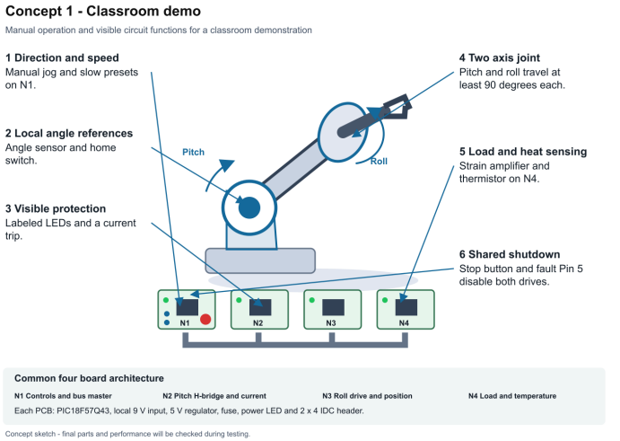
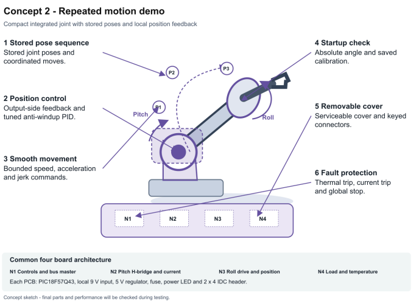
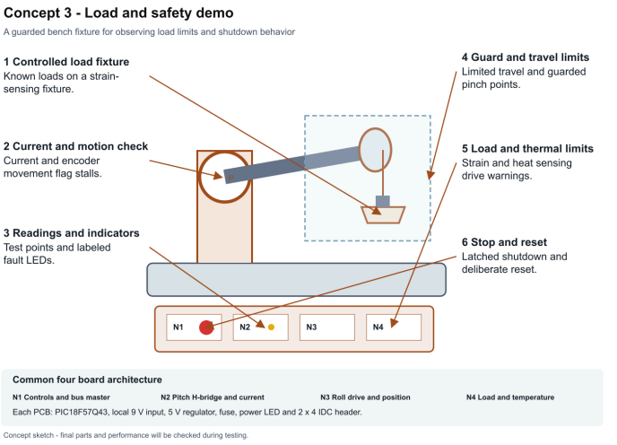

# Team 103 Design Ideation

## Motion Control
* **Angle encoders**
  * **Magnetic encoders** - rugged and compact, at the expense of resolution and EM resistance
  * **Rotary encoder** - super cheap, at the expense of resolution, durability, and ease of installation
  * **Optical encoder** - most precise and most resistant to EM fields, but also prone to wear and will likely be hard to install
* Controller should be able to stop mid-movement from an external command:
  * Interrupts
* Controller should be able to change movement directions mid-movement from an external command:
  * Interrupts
  * Controlled reversal
* Controllers should be able to reference one another to achieve a desired position:
  * USB daisy-chain
  * Direct pin connections
  * USB splitters
  * USB connection through the master controller
* **Forward kinematics solving**
  * Microcontroller - able to solve equations quickly
* **Inverse kinematics solving**
  * Microcontroller - able to solve equations quickly
* **PWM control**
  * Microcontroller - able to give outputs to an H-bridge directly from one of the pins

---

## Material/Component Constraints
* The board itself should be thoroughly tested to ensure its capabilities are known:
  * Computational stress tests
* Direct motor power from controller board:
  * **H-Bridge** - Allows a smaller voltage to control the flow of a high voltage/current. Can be PWM driven
  * **DPDT Relay** - Highly robust and permits very high voltages, but is unable to be driven with PWM
* A fuse should be included to prevent the user from accidentally overvolting the controller:
  * Fuse
  * Breaker
* The controller should be able to understand the position of the arm immediately after being started up:
  * Magnetic Absolute encoders
  * Capacitive absolute encoder
* Calibration should be stored locally:
  * Microcontroller's own storage
  * New storage unit for microcontroller
* Controller should be capable of withstanding external electrical noise:
  * RC Low Filter
  * Shielded cables and Components
* Controller should be able to detect a stall and throw an error:
  * Ability to detect motor current
* Controller should be able to store a custom ID internally:
  * Microcontroller should be able to store information
* Controller should be able to be easily swapped out with another controller of the same model:
  * Modular cables
  * Settings transfer
* Controller should be able to show that it is receiving power:
  * Signal lights
  * Power on sound
* Controller should be able to show what its current state is:
  * Signal lights
  * Data sent to computer
* Motor controller should be able to handle as much kinematic computation as possible in order to free up the host computer:
  * Efficient code
  * Powerful microcontroller
* Homing/calibration of the controller should be simple:
  * Limit Switches
  * Encoders

---

## Precision
* Precise control for repeatability:
  * Motor encoder
* Ambient temperature range from 0–50 °C:
  * Local heatsink
* Angle encoder should be of good quality:
  * Obtain the encoder from a reliable source
* Controller should avoid vibrating once it has reached a specified position:
  * PI-D algorithm
  * Standard PID
  * PD
  * I-PD
  * Anti-windup PID
* Controller shouldn't "rubber band" around the set point:
  * PI-D algorithm
  * Standard PID
  * PD
  * I-PD
  * Anti-windup PID
* Internal PID for ensuring the position of the arm is held:
  * PI-D algorithm
  * Standard PID
  * PD
  * I-PD
  * Anti-windup PID
* Controller should be able to move smoothly:
  * PWM
  * PID

---

## Software
* PID parameters are configurable:
  * Software
* Different gear ratios should be able to be taken into account:
  * User input during setup for set gear ratio
  * Individual gear ratio control for multiple possible gear ratios
* It should be possible for the controller to understand if it needs to be recalibrated:
  * Software
* Controller should be able to "understand" if other magnetic fields are messing with the main one:
  * Multiple encoders
* Controller code should be open source:
  * GitHub
  * Public Files / Google Drive
* Controller should be able to take the fastest "route" to the desired position:
  * Software
* Controller should be able to take in "deadzones" to avoid:
  * Software
* Controller should be able to work with both degrees and radians:
  * Conversion functions built in
* Controller should be able to have its rotation speed controlled:
  * PWM control
  * Encoder feedback
  * Speed settings
* Controller should be able to have its rotation acceleration controlled:
  * Adjustable acceleration ramp
  * S-curve motion profile
* Controller should be able to have its rotation jerk controlled:
  * Software control
* Poor positional feedback should be able to be sorted out:
  * Software - compare most recent encoder values to nearby if above a certain difference discard the data
* Significant quantities of poor positional feedback should throw an error:
  * Counter of how many data points are thrown out
* Significant quantities of poor temperature feedback should throw an error:
  * Counter of how many temperatures are out of expected range
* Attempts to give dead zones which have a good zone between them should throw a warning:
  * Software limits
* Attempts to path to a zone which is sandwiched between two dead zones should throw an error:
  * Software limits
* Driver should be able to interface with Java:
  * Software
* Driver should be able to interface with C languages:
  * Software
* Driver should be able to interface with Python:
  * Software
* Powering on the controller shouldn't make the arm move sporadically:
  * Keep the pin off until the controller is started fully
* The controller should consume minimal power:
  * Software - sleep mode / minimize power when not in use

---

## Safety
* **Collision detection:**
  * Vibration sensor - Could detect the vibrations caused by collisions, however it may not be able to detect softer collisions
  * IMU - Able to detect changes in the movement of the arm. However, it would require the user to install it themselves somewhere near the end of the arm.
  * Proximity sensor - Able to detect if the arm is in close proximity with another object. However, it would require sensors to be placed in several locations on the arm, and each location would have to be measured and taken into account by the user.
  * Angle encoder + Torque reading function in code - By taking the rate of change of the angle encoder and the measured torque from the motor, a collision could be detected if they don't match "ideal" values. This would be hard to implement via code, but it would be the cheapest and wouldn't require new parts.
* **Self collision prevention:**
  * User-input arm dimensions - the user can input the dimensions of the arm in order for the controller to calculate where it can and can't go.
  * User-input arm angle limits - the user can input limits for the angle of each arm segment to prevent the motors from pivoting into themselves.
  * Limit switches can be placed by the user onto pinch points to prevent the arm from hitting itself
* **Safety boundary constraints:**
  * User-input arm dimensions - the user can input the dimensions of the arm in order for the controller to calculate where it can and can't go.
  * User-input arm angle limits - the user can input limits for the angle of each arm segment to prevent the motors from pivoting into themselves.
  * Limit switches - can be placed by the user onto pinch points to prevent the arm from hitting itself
* **Automatic temperature shutoff:**
  * Transistor - a transistor can open if the temperature reading (through a voltage) is too high. However, it would be unable to be configured
  * Software - through taking input readings from the thermistor, the program on the controller can shut down the motor if it is too hot.
* **Watchdog timer:**
  * Internal timer
  * External timer
* Controller should be able to have an emergency shut off command which cuts power to the motor:
  * Estop button on/near controller
  * Computer stop command
  * Latched shutdown

---

## Error Displays / User Communication
* **Computer connection:**
  * USB A - Common, backwards compatible, and provides good transfer rates
  * USB B - Less common, difficult to find, but highly robust
  * USB C - Best power transfer capacity, best data transfer rate, but fragile
  * Bluetooth
* **Error indication lights:**
  * Single RGB LED - Less reliable and more expensive, but is able to transmit the most information in the smallest form factor. Also would be problematic for someone who is colour blind to read
  * Multiple single color LED - Very reliable and still cheap while still being able to provide a significant amount of information, at the expense of space.
  * Single flashing LED - Most reliable, cheapest, and simplest - at the expense of information
* **Errors automatically clear when solved:**
  * Local controller program - A program that could be running constantly on the board may permit the controller to clear errors as soon as they are solved. This could also allow errors to be detected prior to trying out any code.
* **Error reporting to computer with specific information:**
  * USB connection to computer
  * Bluetooth
* **Errors are ranked on their severity:**
  * Software function - Modifications to code could allow functions to be sent back to the master controller in an order from most to least "important"
* **Joint position output:**
  * Direct Data - Easiest to "handle" but would require the master controller to do the computations
  * Calculated angle - Hardest to "handle" but would leave the master controller with less computations
* **Joint torque output:**
  * Torque sensor - Would be easiest to implement, but would be more expensive
  * Motor current + angle calculations - Would be hard to implement, but it would use tech already on the board to roughly calculate the torque the motor is outputting.
* **Motor temperature feedback:**
  * Thermistor - Best precision but worst range
  * Thermocouple - Best range but worst position
* **Motor current draw feedback:**
  * Shunt resistor - Would be relatively simple to implement via a small resistor and op-amps. However, it would require the user to input the resistance of the motor which would make actual measurements less accurate
  * Hall effect current sensor - Would be more complicated to implement, but it would leave the user with less work compared to a shunt resistor.
* Significant force feedback errors should throw an error:
  * Software - Keep count of how many feedback errors occur
  * Current sensor
* Significant force beyond a setable limit should throw an error, but the current position should be held:
  * Current sensor
* Significant current feedback errors should throw an error:
  * Current sensor
* Significant current draw beyond the motor's indicated limit should throw an error:
  * Current sensor
  * Software current limit
  * Warning and shutdown levels
  * Shunt and comparator

---

## Documentation
* Components of the PCB should be clearly labelled:
  * Guide in manual
  * Labeling printed onto PCB
* The controller should have a clear diagram in its manual:
  * Manual
* The controller's code should be well documented to ensure an end user understands what each function does:
  * Comments
* Parameters which may be dangerous to edit should be clearly identified as such:
  * Instructional manual

---

## Casing
* Controller should be compact:
  * Efficient space use in casing
* Controller should be easy to install:
  * Screw holes in casing
* Internal wires which may be prone to getting hot should be kept away from other wires which are sensitive to damage:
  * Cable management channels in casing

---

## Additional Feature Ideas

### 41. Rotation speed control
1. PWM control - change the motor drive level.
2. Encoder feedback - compare the measured speed with the requested speed.
3. Speed settings - slow, medium, and fast.
4. Speed knob on the master controller.

### 42. Rotation acceleration control
1. Adjustable acceleration ramp - gradually increase or decrease speed.
2. S-curve motion profile - make the beginning and end of a move smoother.
3. Adjustable ramp time - choose how long the motor takes to reach the requested speed.

### 47. Significant electrical noise should throw an error
1. Supply-voltage check - flag readings outside the allowed range.
2. Error counter - flag repeated bad sensor readings.

### 51. Current draw above the motor limit should throw an error
1. Shunt resistor and comparator - trigger a fault when current is too high.
2. Software current limit - compare the current reading with a set limit.
3. Warning and shutdown levels - warn first, then stop at a higher limit.

### 57. Emergency shutoff
1. Emergency stop button on or near the controller.
2. Computer stop command through the master controller.
3. Hardware driver disable from the shared fault line.
4. Latched shutdown - require a reset before restarting.

### 59. Change direction during movement
1. Interrupt respond to a new direction command.
2. Controlled reversal - slow down before driving in the opposite direction.
3. Direction limits - prevent reversal into a forbidden angle.

---

## Sorting and Ranking

The main priorities are safety, required movement, useful feedback, and ideas that fit our assigned boards. These rankings use those practical checks, rather than the earlier numerical user-needs weights. The choices below are proposed priorities for the three concepts.

### Motion Control
1. PWM control
2. Angle encoder feedback

*Both are needed to control movement and check where the joint is.*

### Material/Component Constraints
1. H-bridge
2. Fuse and input protection

*These fit the assigned motor board and protect the power input.*

### Precision
1. PID control
2. Repeatable homing

*These help the arm reach the same position each time.*

### Software
1. Safe startup
2. Speed and acceleration settings

*The arm should stay still at startup and move at a controlled rate.*

### Safety
1. Emergency stop and hardware cutoff
2. Temperature shutdown

*These limit damage and unexpected movement.*

### Error displays/User communication
1. Current sensing and comparator
2. Labeled status LEDs

*The system needs to detect overloads and show the user what happened.*

### Documentation
1. Wiring diagram
2. PCB labels

*These make the boards easier to connect and troubleshoot.*

### Casing
1. Secure mounting holes
2. Separate cable paths

*These help keep the boards stable and motor wiring away from sensor wiring.*

Ideas that were not picked stay in the feature list so they can be used later. The required ribbon bus and approved board components take priority over optional ideas such as wireless links or extra sensor modules.

---

## Features Grouped into Three Concepts

Our product is a two-axis robot arm joint demonstration system. It is meant to show students and other viewers how pitch and roll motion, feedback, and protection work together.

All three concepts use the four required controller boards: the master/interface board, pitch motor board, roll motor board, and load/temperature board. Each board keeps its own regulated power and fuse, with the required 8-wire connection between boards.

The main targets are at least 90 degrees of pitch and roll travel, 10 coordinated cycles, motor cutoff in under 20 ms after the shared fault signal, and a 0–5 V load-sensor output over the 0–2 kg calibration range. That sensor range is not a claim about how much the arm can lift.

### Concept 1 - Classroom Demo
* Manual direction and speed controls
* Visible boards and labeled LEDs
* Simple homing and angle feedback
* Emergency stop

This version puts the four boards next to the arm so a student can see the parts and operate the joint using simple direction and speed controls. Labeled LEDs show power and faults.

* Speed settings and direction control support needs 41 and 59.
* Angle feedback and homing support needs 6 and 29.
* Labeled LEDs, current protection, and emergency stop support needs 7, 51, and 57.
* Pitch and roll still need to meet the movement requirement, with the same load and temperature circuits.

**Tradeoff:** Easy to explain and troubleshoot, but the open layout needs more space and protection around moving parts.

### Concept 2 - Repeated Motion Demo
* Saved positions and automatic movement cycles
* Encoder feedback and PID
* Smooth speed and acceleration changes
* Saved calibration and a compact cover

This version focuses on repeating a short sequence of saved positions. Encoder feedback and PID help the joint move smoothly and reach the same positions. The boards sit inside a removable cover.

* Saved positions and coordinated motion support needs 2 and 38.
* PID and angle feedback support needs 14 and 23.
* Acceleration ramps and stored calibration support needs 42 and 31.
* The sequence would demonstrate at least 10 coordinated cycles and the required pitch and roll travel.

**Tradeoff:** Better for showing repeatability, but it needs more tuning and careful encoder setup.

### Concept 3 - Load and Safety Demo
* A controlled load fixture
* Current, load, and temperature readings
* Warning and shutdown limits
* Guarded moving parts and a reset after faults

This version adds a load fixture and a guard so viewers can see how the sensor readings and fault limits work. A warning appears before a shutdown limit, and a serious fault requires a reset.

* Load measurement and feedback checks support needs 9 and 48.
* Current sensing and stall detection support needs 11 and 61.
* Temperature limits and latched stopping support needs 18 and 57.
* The strain circuit is calibrated across the required 0–2 kg sensor range. The fault test checks for cutoff in under 20 ms after the fault signal.

**Tradeoff:** Makes sensor and safety behavior easier to show, but the fixture is larger and any test load must be safe for the mechanism.

---

## Ideation Process

During an online meeting, Elijah Koiki, Ayaan Ahmad, Connor Loos and Walker Knaggs all contributed to a brainstorming session. Related functions and ideas were added to a Google Doc file that all team members had access to. Within the Google Doc a list of starting functions was located within the Function Ideation section and related ideas were grouped within the Submission section. Being within one file allowed for group contribution to one list.

The required functions came from the Product Requirements document, our User Needs and Benchmarking, and previous work done. User needs were used to determine aspects such as user interface, movement, feedback, and operation. The product requirements determined the scope of the project. These included coordinated roll and pitch motion, temperature and load sensing, regulated power, current protection, four controller boards, and an 8-wire bus.

During the brainstorming session over 100 idea instances were generated with 75 functions. Some functions had multiple idea instances while others only had one simple idea instance. The document also included features that could be used in combination with other features and alternative features. Additional ideas were added for stopping, acceleration, speed, current limiting, error handling, and electrical noise errors. The initial list of functions used in the Function Ideation section is maintained so as not to lose initial functions.

The functions were grouped into eight categories: Casing, Documentation, Error displays/User communication, Material/Component Constraints, Precision, Safety, Software and Motion Control. Grouping of functions allowed for easier evaluation between alternative solutions such as different methods of fault communication or different encoder types. Some functions can support multiple user needs. For instance a current sensor can be used for both overload detection and feedback.

Within this document functions are prioritized based on usefulness, necessity, practicality given current hardware, and safety. The prior functions did not use the weights previously assigned to user needs.

Emergency stopping, reliable motor control, and useful feedback are higher priorities than extra convenience features. Two leading ideas are listed for each group, with a short reason. These choices give the team a starting point for deciding which parts to develop.

The features were then combined into three concepts: a classroom demo, a repeated motion demo, and a load and safety demo. They use the same required boards but emphasize different experiences for the viewer. The diagrams show where the selected features would fit.

Manufacturer information from Microchip, Texas Instruments, Littelfuse, and USB-IF was used during refinement to check the controller, current sensing, input protection, and USB descriptions. The next step is to compare the concepts together and test the selected circuits and mechanisms.

---

## Technical Clarifications
* A fuse protects against excessive current. Overvoltage needs a separate protection circuit.
* A shunt current measurement uses the known shunt resistance, not the motor resistance.
* The USB connector shape does not determine its data rate.
* Normal warnings may clear automatically. Serious shutdown faults should require a deliberate reset.
* Use the assigned 8-wire bus to connect the four boards. Optional USB or wireless ideas would need a separate approved interface.
* The thermistor is the baseline temperature sensor. Other temperature sensors remain brainstorm alternatives.

---

## References
* Team 103 - User Needs and Benchmarking.
* Team 103 - Product Requirements, version 1.0, September 18, 2026.
* Microchip - PIC18-Q43 overview: [https://www.microchip.com/en-us/products/microcontrollers/8-bit-mcus/pic-mcus/pic18-q43](https://www.microchip.com/en-us/products/microcontrollers/8-bit-mcus/pic-mcus/pic18-q43)
* Texas Instruments - H-bridge current sensing: [https://www.ti.com/document-viewer/lit/html/SLLA528](https://www.ti.com/document-viewer/lit/html/SLLA528)
* Texas Instruments - Overcurrent comparator circuit: [https://www.ti.com/tool/CIRCUIT060034](https://www.ti.com/tool/CIRCUIT060034)
* Littelfuse - Fuse guidance: [https://www.littelfuse.com/products/fuses-overcurrent-protection/fuses/cartridge-fuses](https://www.littelfuse.com/products/fuses-overcurrent-protection/fuses/cartridge-fuses)
* USB-IF - USB Type-C language guidelines: [https://www.usb.org/sites/default/files/usb_type-c_language_product_and_packaging_guidelines_20230320.pdf](https://www.usb.org/sites/default/files/usb_type-c_language_product_and_packaging_guidelines_20230320.pdf)

---

## Concept Sketches

### Concept 1 - Classroom Demo

> **Concept 1 Classroom demo**  
> *Manual operation and visible circuit functions for a classroom demonstration*
> 
> 1. **Direction and speed** - Manual jog and slow presets on N1.
> 2. **Local angle references** - Angle sensor and home switch.
> 3. **Visible protection** - Labeled LEDs and a current trip.
> 4. **Two axis joint** - Pitch and roll travel at least 90 degrees each.
> 5. **Load and heat sensing** - Strain amplifier and thermistor on N4.
> 6. **Shared shutdown** - Stop button and fault Pin 5 disable both drives.
>
> **Common four board architecture:**  
> * **N1:** Controls and bus master  
> * **N2:** Pitch H-bridge and current  
> * **N3:** Roll drive and position  
> * **N4:** Load and temperature  
> *Each PCB: PIC18F57Q43, local 9 V input, 5 V regulator, fuse, power LED and 2 x 4 IDC header.*  
> *Concept sketch-final parts and performance will be checked during testing.*

---

### Concept 2 - Repeated Motion Demo

> **Concept 2 - Repeated motion demo**  
> *Compact integrated joint with stored poses and local position feedback*
> 
> 1. **Stored pose sequence** - Stored joint poses and coordinated moves.
> 2. **Position control** - Output-side feedback and tuned anti-windup PID.
> 3. **Smooth movement** - Bounded speed, acceleration and jerk commands.
> 4. **Startup check** - Absolute angle and saved calibration.
> 5. **Removable cover** - Serviceable cover and keyed connectors.
> 6. **Fault protection** - Thermal trip, current trip and global stop.
>
> **Common four board architecture:**  
> * **N1:** Controls and bus master  
> * **N2:** Pitch H-bridge and current  
> * **N3:** Roll drive and position  
> * **N4:** Load and temperature  
> *Each PCB: PIC18F57Q43, local 9 V input, 5 V regulator, fuse, power LED and 2 x 4 IDC header.*  
> *Concept sketch-final parts and performance will be checked during testing.*

---

### Concept 3 - Load and Safety Demo

> **Concept 3 - Load and safety demo**  
> *A guarded bench fixture for observing load limits and shutdown behavior*
> 
> 1. **Controlled load fixture** - Known loads on a strain-sensing fixture.
> 2. **Current and motion check** - Current and encoder movement flag stalls.
> 3. **Readings and indicators** - Test points and labeled fault LEDs.
> 4. **Guard and travel limits** - Limited travel and guarded pinch points.
> 5. **Load and thermal limits** - Strain and heat sensing drive warnings.
> 6. **Stop and reset** - Latched shutdown and deliberate reset.
>
> **Common four board architecture:**  
> * **N1:** Controls and bus master  
> * **N2:** Pitch H-bridge and current  
> * **N3:** Roll drive and position  
> * **N4:** Load and temperature  
> *Each PCB: PIC18F57Q43, local 9 V input, 5 V regulator, fuse, power LED and 2 x 4 IDC header.*  
> *Concept sketch-final parts and performance will be checked during testing.*
